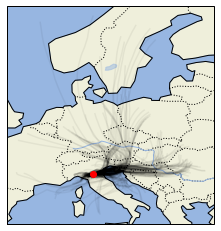

```python
# project name: po_traj
# created by diego aliaga daliaga_at_chacaltaya.edu.bo
```


```python
import pandas as pd
```


```python
path_data = '/Users/diego/po_traj/po_traj/data/traj4jiali.csv'
df = pd.read_csv(path_data)
```


```python

# for easy column referring
traj_parcel_time_UTC = 'traj_parcel_time_UTC'
traj_start_UTC = 'traj_start_UTC'
lat = 'lat'
lon = 'lon'
height = 'height'
pressure = 'pressure'

station_lat = 44.629
station_lon = 10.949
```


```python

```


```python
# convert to datetime64 format
df[traj_start_UTC] = pd.to_datetime(df[traj_start_UTC])
df[traj_parcel_time_UTC] = pd.to_datetime(df[traj_parcel_time_UTC])
```


```python

# group trajectories by their starting time
dg = df.groupby(traj_start_UTC)
```


```python

# imports for the plotting
import cartopy.mpl.geoaxes
import cartopy.crs as ccrs
import cartopy.feature as cfeature
import matplotlib.pyplot as plt


fig = plt.figure()
ax:cartopy.mpl.geoaxes.GeoAxesSubplot = fig.add_subplot(
    1, 1, 1, projection=ccrs.PlateCarree())
# ax.set_extent([-20, 60, -40, 45], crs=ccrs.PlateCarree())

# plot all trajectories
for label,row in dg:
    # print(label)
    ax.plot(row[lon],row[lat], color='k', alpha = .05)

# plot station marker
ax.scatter(station_lon,station_lat,
           color='red',
           # make it visible above the trajectory lines and features
           zorder = 10
           )

# add features to the map. you can comment stuff out if you dont want it
ax.add_feature(cfeature.LAND)
ax.add_feature(cfeature.OCEAN)
ax.add_feature(cfeature.COASTLINE)
ax.add_feature(cfeature.BORDERS, linestyle=':')
ax.add_feature(cfeature.LAKES, alpha=0.5)
ax.add_feature(cfeature.RIVERS)

plt.show()
```




